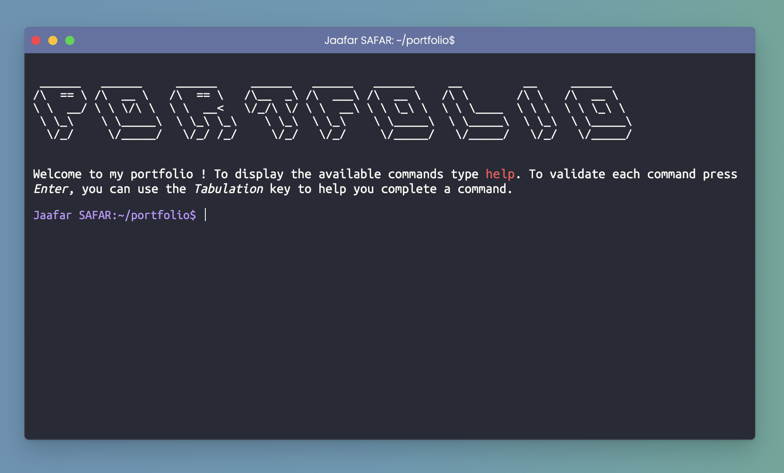

<h1 align="center">
   
  
   
Portfolio Terminal 
</h1>
<h4 align="center">Presentation of my portfolio in the form of a terminal. Real terminal commands can be used on the site, however, if you are not familiar with them, you will be easily guided to navigate through.</h4>
 

## WEB version 🌐

The site is live here 👉 [portfolio](https://jaafarportfolio.com/)

## Technologies used ⚙️

The following technologies were used for this program:  

 
 
The site is responsive. Enjoy your discovery!

